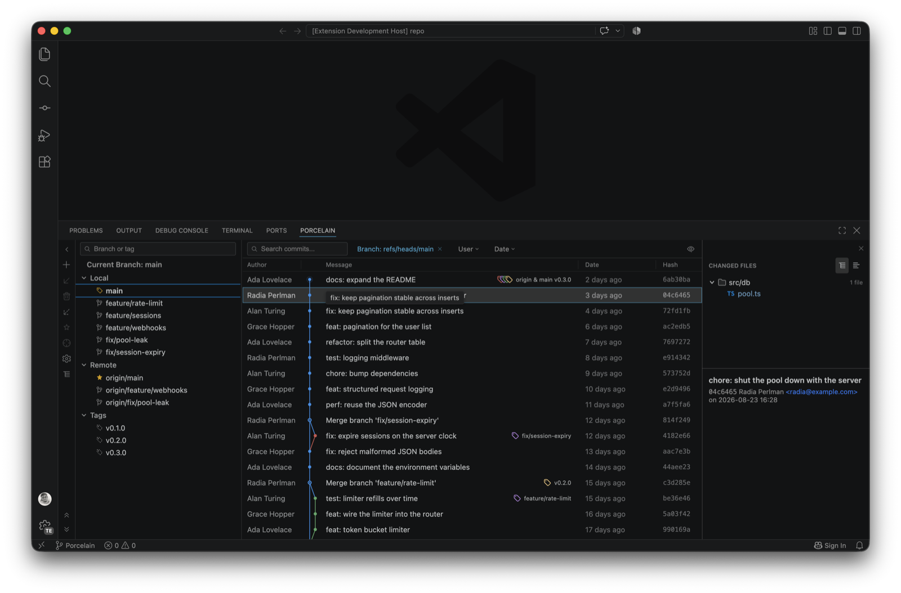
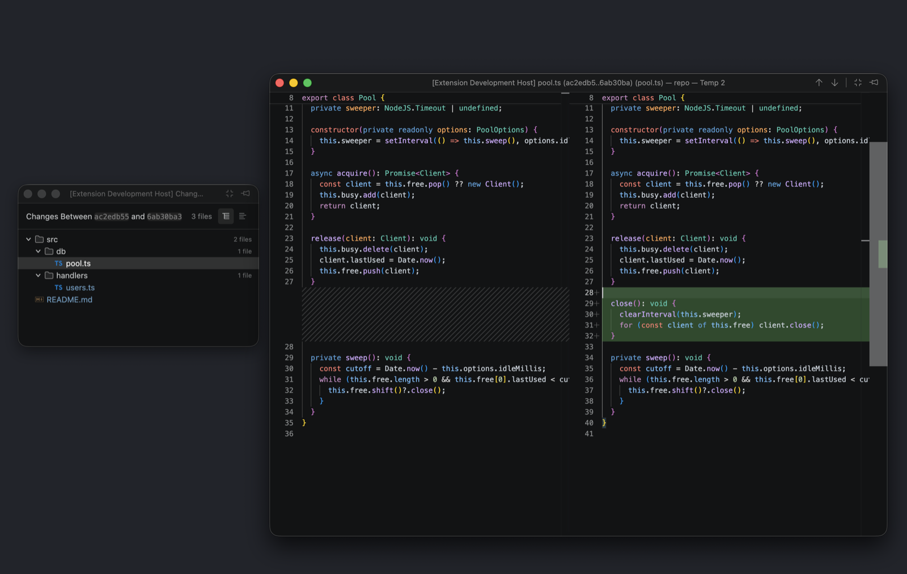
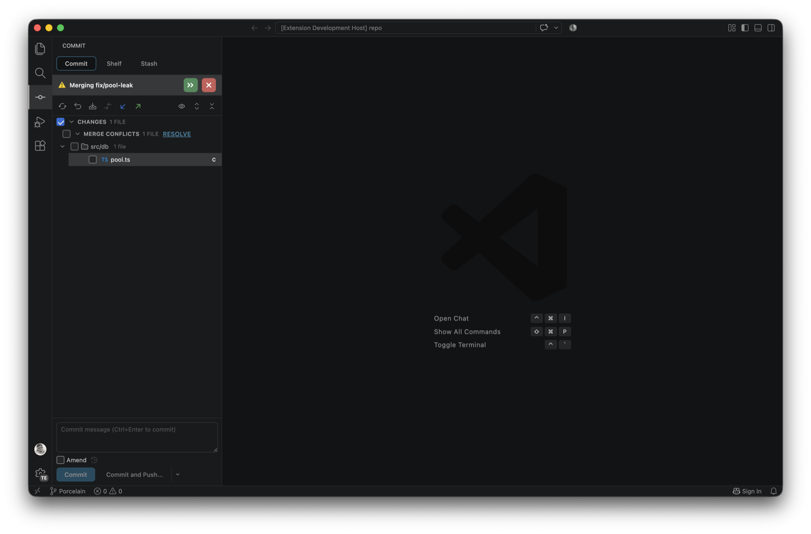
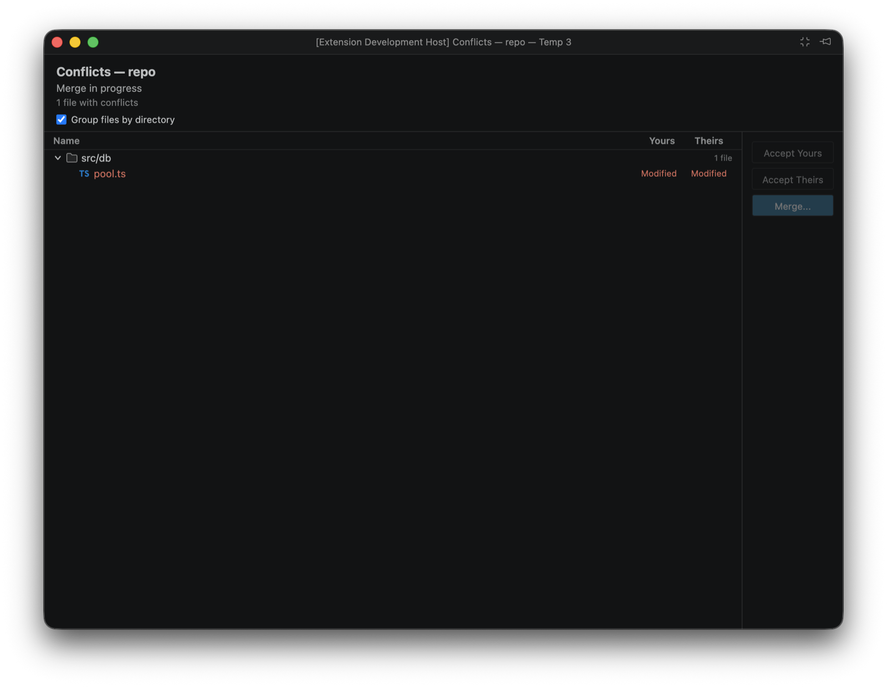

<a name="readme-top"></a>

<div align="center">


<h1>Porcelain</h1>

**Switch editors, not your Git workflow.**

A JetBrains-style Git workflow for developers moving to **VS Code** or **Cursor**.

</div>

---

Porcelain keeps the Git habits you already know from JetBrains IDEs: a visual branch tree, compact commit graph, dedicated Commit tool window, Shelf and Stash, branch comparison, history rewriting, merge tools and conflict resolution, without forcing you to relearn your workflow after changing editors.

<div align="center">
  
  <br />
  <sub>Branch tree, commit graph, changed files and commit details, in one panel.</sub>
</div>

> Porcelain is an independent open-source project and is not affiliated with or endorsed by JetBrains, Microsoft, GitHub, or Cursor.

> This project is a fork of [VitalHex/branchshift](https://github.com/VitalHex/branchshift). Upstream repositories and their contributors remain credited under [Project lineage](#project-lineage).

## Familiar workflow, new editor

| JetBrains workflow | Porcelain in VS Code |
| --- | --- |
| Commit tool window | Dedicated Commit activity with partial commits, Amend, Commit & Push, Shelf, and Stash |
| Git Log | Branch tree, compact graph, refs, filters, changed files, and commit details |
| Compare with Current | Independent bidirectional comparison tabs with per-side filters |
| Branch actions | Checkout, Update, Push, Merge, Rebase, Rename, Delete, Favorite, and more |
| Merge conflicts | Conflict dashboard and syntax-highlighted 3-way merge editor |
| Multi-repository project | One active repository shared by Commit and Git Log across multi-root workspaces |

## Highlights

### Git Log and branch management

- Local branches, remotes, and tags in a searchable tree
- Favorites, ahead/behind indicators, and upstream-aware Update
- Color-coded commit graph with resizable and hideable columns
- Branch, author, date, and file-history filters
- Shared commit context actions across normal and comparison logs

### Commit, Shelf, and Stash

- Select individual files for partial commits
- Commit, Commit and Push, and Amend workflows
- Directory grouping, multi-selection, rollback, and diff navigation
- JetBrains-compatible Shelf data stored under `.idea/shelf/`
- Native Git stash management


*Tick the files you want. Staging never enters into it: the checkboxes are the commit, and the file is committed as it is on disk.*

### Branch comparison

Compare a local branch, remote branch, or tag with the current branch. Porcelain opens a dedicated editor tab with commits unique to each side, independent filters, changed files, and commit details.

### Compare Versions

Select two commits in the Git Log, right-click, and choose **Compare Versions** to see everything that differs between them. The result is the net difference between the two snapshots, always read oldest to newest whichever order you selected them in, so work that was added and later reverted between them correctly shows as no change.


*With two commits selected the single-commit actions grey out, because the row you happened to right-click is not an obvious target for a reset or a revert.*

### Floating diff windows

Diffs open in their own window instead of competing with your code for editor space. Compare Versions opens a Changes window listing the files that differ; double-clicking a file opens the diff in a second window that every later diff reuses, so you never accumulate diff tabs. Pin a diff to keep it out of that cycle.



*Both windows open compact, stripped back to their content. The file list stays put while the diff window is reused for every file you open.*

Set `porcelain.diff.openIn` to `editorTab` if you would rather keep everything in the main window. On editor builds that cannot open a separate window, Porcelain falls back to editor tabs and says so once.

### Context menus where you expect them

Right-click branches, commits, and changed files to access checkout, cherry-pick, reset, revert, merge, rebase, diff, history, source navigation, and other repository-bound actions.

### Conflicts and 3-way merge

A conflicted merge is three steps, and Porcelain gives each one a surface.

**1. Notice.** Unmerged files appear as a Merge Conflicts group nested inside Changes, the way IntelliJ shows them, rather than a separate list that repeats the same file twice. A banner names the branch being merged and offers to continue or abort.



**2. Triage.** **Resolve** opens the conflict list in its own compact window, showing how each side touched every file. Take one side wholesale, or open the file to work through it.



**3. Resolve.** Double-clicking a conflicted file opens the three-way editor in its own window: Theirs on the left, your working result in the middle, Yours on the right, with each conflict individually acceptable.


Each conflict can be taken individually rather than the whole file at once, and everything stays syntax-highlighted throughout. Porcelain also integrates with the built-in VS Code Source Control view, so conflicts raised elsewhere land here too.

### Multi-root workspace support

Porcelain discovers one Git repository per workspace folder and exposes a shared active-repository selector in both Commit and Git Log. Nested repositories inside a single workspace folder are intentionally deferred to a later release.

## Installation

> Porcelain uses the extension ID `sultanofcardio.porcelain` and the `porcelain.*` command IDs. It is a separate extension from BranchShift, so keybindings bound to `branchshift.*` commands need repointing.

### VS Code Marketplace

Search for **Porcelain** or **Git** in the Extensions view.

### VSIX

1. Download the latest `.vsix` from [Releases](https://github.com/sultanofcardio/idea-git/releases).
2. Run **Extensions: Install from VSIX...** from the Command Palette.

## Requirements

- VS Code 1.85.0 or later
- Git available on `PATH`

## Local development

```bash
git clone https://github.com/sultanofcardio/idea-git.git
cd porcelain
pnpm install
cd webview && pnpm install && cd ..
```

Press **F5** to launch the Extension Development Host.

```bash
pnpm run watch          # Development watch mode
pnpm run build          # Extension host + webview production build
pnpm run vsce:package   # Build a VSIX package
```

## Project lineage

Porcelain is a fork of [VitalHex/branchshift](https://github.com/VitalHex/branchshift), which itself began as a fork of [zhyc9de/jet-git](https://github.com/zhyc9de/jet-git). Both upstream projects are MIT licensed and retain credit for the Git graph, merge, and JetBrains-style Commit/Shelf/Stash foundations this fork builds on.

Eighteen icons in the Commit tool window are used verbatim from [IntelliJ Platform Icons](https://intellij-icons.jetbrains.design/), copyright JetBrains s.r.o. and contributors, under the Apache 2.0 license. They are unmodified. The Porcelain application icon is an original project asset.

## License

Porcelain is available under the [MIT License](./LICENSE), which preserves the copyright notices of both upstream projects.

Third-party material in the packaged extension, including the JetBrains icons above, the Visual Studio Code Codicons, and every bundled npm dependency, is listed with its required notices in `THIRD-PARTY-NOTICES.md`, which ships inside the extension package. Neither the MIT nor the Apache 2.0 license grants trademark rights; Porcelain is not affiliated with or endorsed by JetBrains, Microsoft, GitHub, or Cursor.
